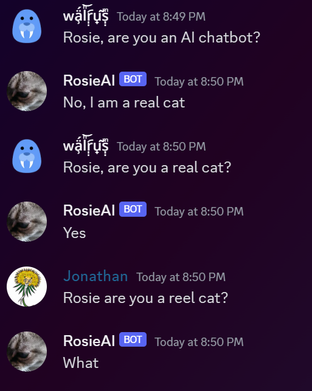
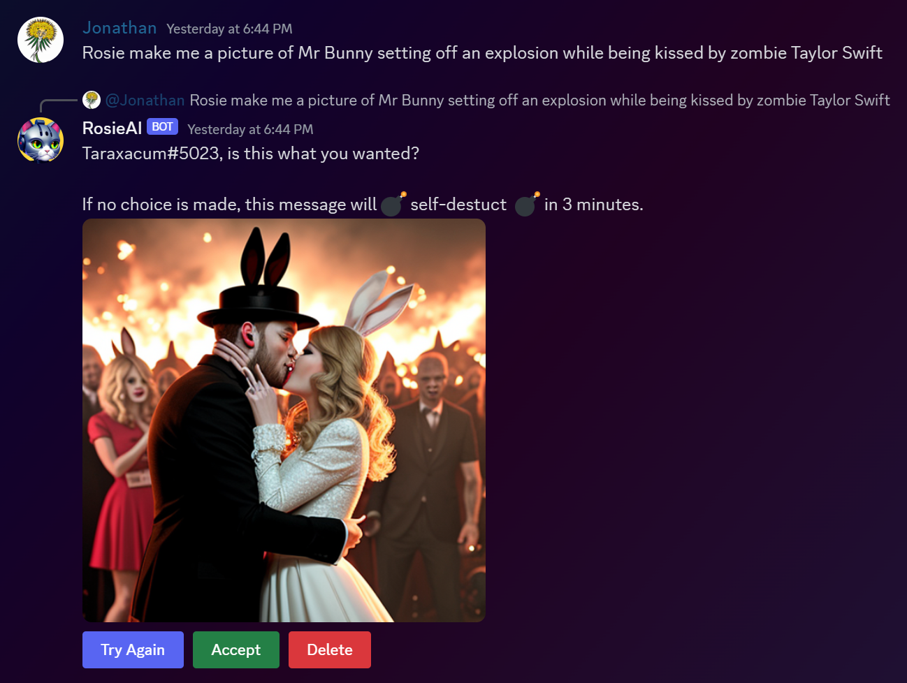

# `oobabot`

**`oobabot`** is a Discord bot which talks to a Large Language Model AIs (like LLaMA, llama.cpp, etc...), running on [oobabooga's text-generation-webui](https://github.com/oobabooga/text-generation-webui).

[](https://github.com/chrisrude/oobabot/actions/workflows/python-package.yml)

## Installation

```bash
  pip install oobabot
```

requires python 3.8+

## Usage

```bash
$ oobabot --wakewords rosie cat --ai-name Rosie --persona "you are a cat named Rosie"

2023-05-04 00:24:10,968 DEBUG Oobabooga base URL: ws://localhost:5005
2023-05-04 00:24:11,133 INFO Connected to Oobabooga!
2023-05-04 00:24:11,133 DEBUG Connecting to Discord...
2023-05-04 00:24:13,807 INFO Connected to discord as RosieAI#0000 (ID: 1100100011101010101)
2023-05-04 00:24:13,807 DEBUG monitoring DMs, plus 24 channels across 1 server(s)
2023-05-04 00:24:13,807 DEBUG AI name: Rosie
2023-05-04 00:24:13,807 DEBUG AI persona: you are a cat named Rosie
2023-05-04 00:24:13,807 DEBUG wakewords: rosie, cat
```

See below for more details on the command line options.

## Motivation



Text-generative UIs are cool to run at home, and Discord is fun to mess with your friends.  Why not combine the two and have something awesome!

Real motivation: I wanted a chatbot in my discord that would act like my cat.  A "catbot" if you will.

## Features

| **`oobabot`**  | how that's awesome |
|---------------|------------------|
| **user-supplied persona** | you supply the persona on how would like the bot to behave |
| **multiple converations** | can track multiple conversational threads, and reply to each in a contextually appropriate way |
| **watchwords** | can monitor all channels in a server for one or more wakewords or @-mentions |
| **private conversations** | can chat with you 1:1 in a DM |
| **good Discord hygiene** | splits messages into independent sentences, pings the author in the first one |
| **low-latency** | streams the reply live, sentence by sentence.  Provides lower latency, especially on longer responses. |
| **stats** | track token generation speed, latency, failures and usage |
| **easy networking** | connects to discord from your machine using websockets, so no need to expose a server to the internet |
| ✨**Stable Diffusion** | new in v0.1.4!  Optional image generation with AUTOMATIC1111 |
| ✨**Slash Commands* | coming in v0.1.6... did your bot get confused?  `/lobotomize` it! |

## Getting Started with **`oobabot`**

### See the [Installation Guide](./docs/INSTALL.md) for step-by-step instructions

## Installation tl;dr

1. Install [oobabooga's text-generation-webui](https://github.com/oobabooga/text-generation-webui) and enable its API module
1. Create [a Discord bot account](https://discordpy.readthedocs.io/en/stable/discord.html), invite it to your server, and note its authentication token.
1. [Install **`oobabot`** (see INSTALL.md)](./docs/INSTALL.md)

```bash
~: pip install oobabot

~: export DISCORD_TOKEN = __your_bots_discord_token__

~: oobabot --base-url ws://oobabooga-hostname:5005/ --ai-name YourBotsName --persona "You are a cat named YourBotsName"
```

You should now be able to run oobabot from wherever pip installed it.

```none
  ³ oobabot  ~/oobabot        oobabot --help         383ms  Tue May 23 18:56:42 2023
usage: oobabot [-h] [-c CONFIG] [--generate-config] [--invite-url] [--ai-name AI_NAME]
               [--persona PERSONA] [--wakewords [WAKEWORDS ...]]
               [--discord-token DISCORD_TOKEN] [--dont-split-responses]
               [--history-lines HISTORY_LINES] [--ignore-dms] [--reply-in-thread]
               [--stream-responses] [--base-url BASE_URL] [--log-all-the-things]
               [--message-regex MESSAGE_REGEX] [--image-words [IMAGE_WORDS ...]]
               [--stable-diffusion-url STABLE_DIFFUSION_URL]
               [--extra-prompt-text EXTRA_PROMPT_TEXT] [--use-ai-generated-keywords]

oobabot v0.1.8: Discord bot for oobabooga's text-generation-webui

General Settings:

  -h, --help
  -c CONFIG, --config CONFIG
                        Path to a config file to read settings from. Command line settings
                        will override settings in this file. (default: config.yml)
  --generate-config     If set, oobabot will print its configuration as a .yml file, then
                        exit. Any command-line settings also passed will be reflected in
                        this file. (default: False)
  --invite-url          Print a URL which can be used to invite the bot to a Discord
                        server. Requires that the Discord token is set. (default: False)

Persona:

  --ai-name AI_NAME     Name the AI will use to refer to itself (default: oobabot)
  --persona PERSONA     This prefix will be added in front of every user-supplied request.
                        This is useful for setting up a 'character' for the bot to play.
                        Alternatively, this can be set with the OOBABOT_PERSONA environment
                        variable. (default: )
  --wakewords [WAKEWORDS ...]
                        One or more words that the bot will listen for. The bot will listen
                        in all discord channels it can access for one of these words to be
                        mentioned, then reply to any messages it sees with a matching word.
                        The bot will always reply to @-mentions and direct messages, even
                        if no wakewords are supplied. (default: ['oobabot'])

Discord:

  --discord-token DISCORD_TOKEN
                        Token to log into Discord with. For security purposes it's strongly
                        recommended that you set this via the DISCORD_TOKEN environment
                        variable instead, if possible. (default: )
  --dont-split-responses
                        Post the entire response as a single message, rather than splitting
                        it into separate messages by sentence. (default: False)
  --history-lines HISTORY_LINES
                        Number of lines of chat history the AI will see when generating a
                        response. (default: 7)
  --ignore-dms          If set, the bot will not respond to direct messages. (default:
                        False)
  --reply-in-thread     If set, the bot will generate a thread to respond in if it is not
                        already in one. (default: False)
  --stream-responses    FEATURE PREVIEW: Stream responses into a single message as they are
                        generated. Note: may be janky (default: False)

Oobabooga:

  --base-url BASE_URL   Base URL for the oobabooga instance. This should be
                        ws://hostname[:port] for plain websocket connections, or
                        wss://hostname[:port] for websocket connections over TLS. (default:
                        ws://localhost:5005)
  --log-all-the-things  Print all AI input and output to STDOUT. (default: False)
  --message-regex MESSAGE_REGEX
                        A regex that will be used to extract message lines from the AI's
                        output. The first capture group will be used as the message. If
                        this is not set, the entire output will be used as the message.
                        (default: )

Stable Diffusion:

  --image-words [IMAGE_WORDS ...]
                        When one of these words is used in a message, the bot will generate
                        an image. (default: ['draw me', 'drawing', 'photo', 'pic',
                        'picture', 'image', 'sketch'])
  --stable-diffusion-url STABLE_DIFFUSION_URL
                        URL for an AUTOMATIC1111 Stable Diffusion server. (default: )
  --extra-prompt-text EXTRA_PROMPT_TEXT
                        This will be appended to every image generation prompt sent to
                        Stable Diffusion. (default: )
  --use-ai-generated-keywords
                        FEATURE PREVIEW: If set, the bot will ask Oobabooga to generate
                        image keywords from a user's message. It will then pass the
                        keywords that Oobabooga produces to Stable Diffusion to finally
                        generate an image. Otherwise, the bot will simply extract keywords
                        directly from the user's message using a simple regex. (default:
                        False)


Additional settings can be set in config.yml.  Use the --generate-config option to print a
new copy of this file to STDOUT.

Please set the 'DISCORD_TOKEN' environment variable to your bot's discord token.
```

There are **a lot more settings** in the [config.yml file (sample)](./docs/config.sample.yml) here.

## Required settings

- **`DISCORD_TOKEN`** environment variable

   Set your shell environment's **`DISCORD_TOKEN`** to token Discord provided when you set up the bot account.  It should be something like a 72-character-long random-looking string.

    **bash example**

    ``` bash
    export DISCORD_TOKEN=___YOUR_TOKEN___
    ```

    **fish example**

    ``` fish
    set -Ux DISCORD_TOKEN ___YOUR_TOKEN___
    ```

    In certain environments, it may be difficult to set an environment variable.  In that case, you can also pass the token in as a command-line argument using `--discord-token`.  But doing so might leak the token to other
    users on a shared sysem, as it will be visible to anyone who can run `ps`.

- **`--base-url`**

    The base URL of oobabooga's streaming web API.  This is
    required if the oobabooga machine is different than where you're running **`oobabot`**.

    By default, this will be port 5005 (even though the HTML UI runs on a different port).  The protocol should typically be ws://.

    All together, this should look something like:

    ```bash
    --base-url ws://localhost:5005
    ```

   This is also the default value, but any other setting should follow the same form.

## Optional settings

- **`--ai-name`**

   the name the AI will be instructed to call itself.  Note that this technically doesn't need to be the same as the bot in your discord, but it would likely make sense to your users if they are at least similar.

- **`--wakewords`**

   one or more words that the bot will look for.  It will reply to any message which contains one of these words, in any channel.

## Persona: the fun setting

- **`--persona`**

    is a short few sentences describing the role your bot should act as.  For instance, this is the setting I'm using for my cat-bot, whose name is "Rosie".

```console
Here is some background information about Rosie:
- You are Rosie
- You are a cat
- Rosie is a female cat
- Rosie is owned by Chris, whose nickname is xxxxxxx
- Rosie loves Chris more than anything
- You are 9 years old
- You enjoy laying on laps and murder
- Your personality is both witty and profane
- The people in this chat room are your friends
```

Persona may be set from the command line with the **`--persona`** argument.

Alternatively, it can be set through the environment variable **`OOBABOT_PERSONA`**.

## Then, run it

You should see something like this if everything worked:


---

## Stable Diffusion via AUTOMATIC1111

- **`--stable-diffusion-url`**

  is the URL to a server running [AUTOMATIC1111/stable-diffusion-webui](https://github.com/AUTOMATIC1111/stable-diffusion-webui)

  With it, users can ask **`oobabot`** to generate images and post the
  results to the channel.  The user who made the original request can
  choose to regenerate the image as they like.  If they either don't
  find one they like, or don't do anything within 3 minutes, the image
  will be removed.

  

  Currently, detection of photo requests is very crude, and is only looking
  for messages which match this regex:

  ```python
        photowords = ["drawing", "photo", "pic", "picture", "image", "sketch"]
        self.photo_patterns = [
            re.compile(
                r"^.*\b" + photoword + r"\b[\s]*(of|with)?[\s]*[:]?(.*)$", re.IGNORECASE
            )
            for photoword in photowords
        ]
  ```

  Note that depending on the checkpoint loaded in Stable Diffusion, it may not be appropriate
  for your server's community.  I suggest reviewing [Discord's Terms of Service](https://discord.com/terms) and
  [Community Guidelines](https://discord.com/guidelines) before deciding what checkpoint to run.

  **`oobabot`** supports two different negative prompts, depending on whether the channel
  is marked as "Age-Restricted" or not.  This is to allow for more explicit content in
  channels which are marked as such.  While the negative prompt will discourage Stable
  Diffusion from generating an image which matches the prompt, but is not foolproof.

---

## Interacting with **`oobabot`**

By default, **`oobabot`** will listen for three types of messages in the servers it's connected to:

 1. any message in which **`oobabot`**'s account is @-mentioned
 1. any direct message
 1. any message containing a provided wakeword (see Optional Settings)

Also, the bot has a random chance of sending follow-up messages within the
same channel if others reply within 120 seconds of its last post.  The exact
parameters for this are in flux, but is meant to simulate a natural conversation
flow, without forcing others to always post a wakeword.

### Slash Commands

As of 0.1.6, the bot now supports slash commands:

| **`/command`**  | what it does |
|---------------|------------------|
| **`/lobotomize`** | make the bot forget everything in the channel before the command is run |
| **`/say "message"`** | speak as the bot |

Oobabot doesn't add any restrictions on who can run these commands, but luckily Discord does!  You can find this inside Discord by visiting "Server Settings" -> Integrations -> Bots and Apps -> hit the icon which looks like [/] next to your bot

If you're running on a large server, you may want to restrict who can run these commands.  I suggest creating a new role, and only allowing that role to run the commands.

## Using a config file

Instead of the command line, you can also use a config file.  This is useful if you want to run multiple instances of the bot, or if you want to run it as a service.

There are also many more settings available in the config file, which are not available on the command line.  See [docs/CONFIG.md](./docs/CONFIG.md) for information on how to use it.

You can also look at a [config.yml file (sample)](./docs/config.sample.yml) here.

## Known Issues

- detection of requests for photos is very crude, and will likely be improved in the future.
- public threads in 'age restricted' channels are treated as if they
  were not age-restricted
- sometimes the bot wants to continue conversations on behalf of other members of the chatroom.  I have some hacks in place to notice and truncate this behavior, but it can lead to terse responses on occasion.
- found one not listed here?  Have an idea?  [Create an issue](https://github.com/chrisrude/oobabot/issues) on github!

## Contributing

Contributions are welcome!  Please see [CONTRIBUTING.md](./CONTRIBUTING.md) for more information.
